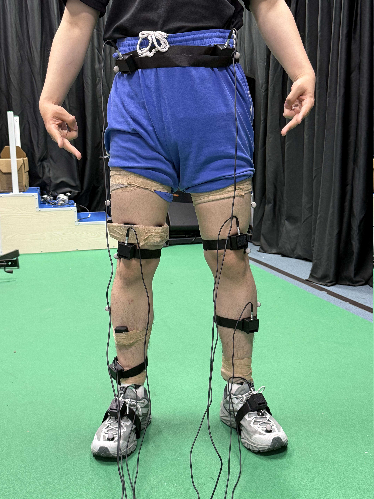
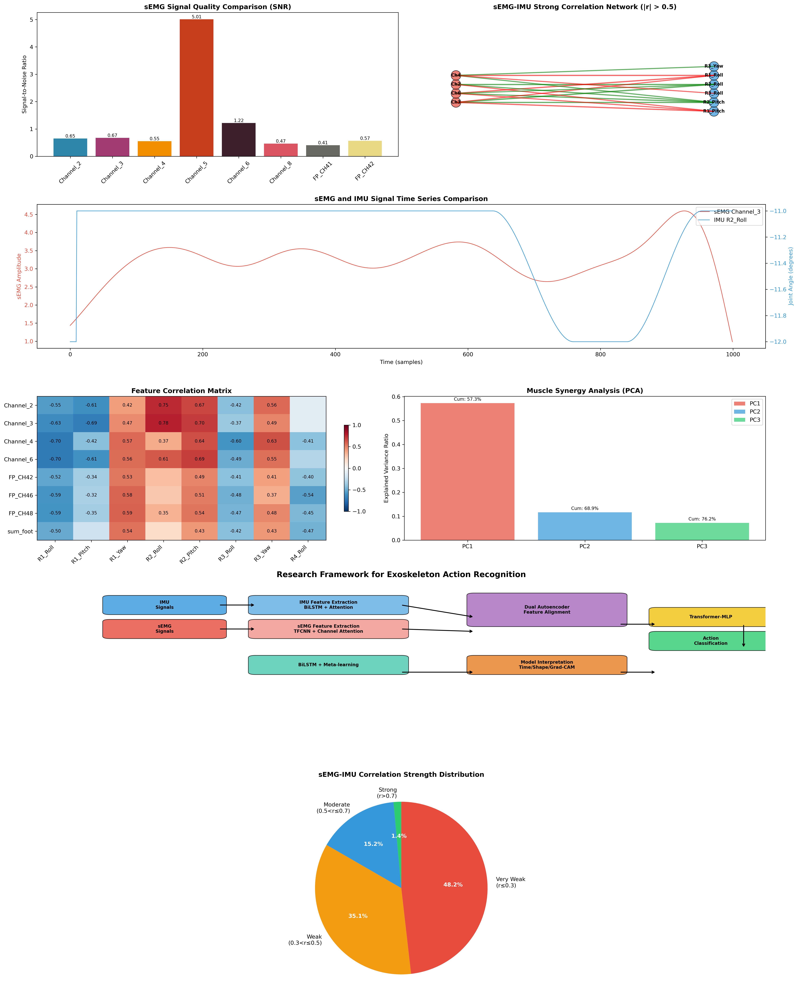

# Multimodal Exoskeleton Jump Recognition

Reproducible research code for recognizing **vertical jump** and **long jump** movements from synchronised surface electromyography (sEMG) and inertial measurement unit (IMU) signals collected during civilian exoskeleton experiments.

> Status: research prototype. The repository contains code, aggregate metadata, and documentation. Human-participant recordings are intentionally excluded from Git.

## Project overview

Full project report: [Multimodal Jump Recognition for a Civilian Exoskeleton — End-to-End Project Report](docs/PROJECT_REPORT_EN.md)

完整中文项目报告：[民用外骨骼跳跃动作多模态识别项目——中文全流程报告](docs/PROJECT_REPORT_ZH.md)

Technical work and individual contributions: [English](docs/TECHNICAL_CONTRIBUTIONS_EN.md) | [中文](docs/TECHNICAL_CONTRIBUTIONS_ZH.md)

Reference documentation: data dictionary ([English](docs/DATA_DICTIONARY.md) / [中文](docs/DATA_DICTIONARY_ZH.md)) | data audit ([English](docs/DATA_AUDIT.md) / [中文](docs/DATA_AUDIT_ZH.md)) | processing pipeline ([English](docs/PIPELINE.md) / [中文](docs/PIPELINE_ZH.md)) | model validity ([English](docs/MODEL_VALIDITY.md) / [中文](docs/MODEL_VALIDITY_ZH.md))

Sensor-placement photograph and evidence boundary: [English](docs/SENSOR_PLACEMENT.md) | [中文](docs/SENSOR_PLACEMENT_ZH.md)



Multi-model evaluation: [experiment protocol](docs/EXPERIMENT_BENCHMARK.md) | [Google Colab runner](notebooks/ExoJump_Cloud_Benchmark.ipynb) | Full benchmark ([English](results/COLAB_FULL_BENCHMARK.md) / [中文](results/COLAB_FULL_BENCHMARK_ZH.md)) | Quick smoke test ([English](results/COLAB_QUICK_BENCHMARK.md) / [中文](results/COLAB_QUICK_BENCHMARK_ZH.md))

IMU-only deployment experiment: [English](results/IMU_EVENT_BENCHMARK.md) | [中文](results/IMU_EVENT_BENCHMARK_ZH.md) | [machine-readable metrics](results/imu_event_metrics.json)

IMU-node retraining ablation: [English](results/SENSOR_ABLATION.md) | [中文](results/SENSOR_ABLATION_ZH.md) | [machine-readable metrics](results/sensor_ablation_metrics.json)

Compact IMU configurations: [English](results/COMPACT_SENSOR_CONFIGURATIONS.md) | [中文](results/COMPACT_SENSOR_CONFIGURATIONS_ZH.md) | [machine-readable metrics](results/compact_sensor_metrics.json)

Compact time-series Transformer benchmark and overfitting analysis: [English](results/TRANSFORMER_BENCHMARK.md) | [中文](results/TRANSFORMER_BENCHMARK_ZH.md) | [machine-readable metrics](results/transformer_metrics.json)

The recovered experiment archive contains **six participants** and two movement classes. A front-view experiment photograph shows **eight black IMU modules arranged bilaterally, four per side: waist, anterior distal thigh just above the knee, anterior lower leg, and dorsum of the foot**. Because stable output was not available from every node in every acquisition batch, the historical processing retained four consistently usable IMU groups (R1–R4) for modelling. Conversion order, legacy biomechanical constraints, the right-side sEMG setup, and ablation behaviour jointly support the working reconstruction **R1 waist/hip, R2 distal thigh, R3 anterior lower leg, and R4 dorsum of foot**, most likely from the right-side chain. This anatomical mapping has moderate confidence because hardware IDs were not preserved. A total of 227 IMU/sEMG session pairs were reported during alignment; 224 paired sessions are present in the final aligned directory. The processing records show:

- 1 kHz target sampling for both modalities;
- auditing of an eight-node bilateral IMU array (four nodes per side) and selection of four stable nodes;
- conversion of the retained nodes into 12 orientation channels (four sensors × roll/pitch/yaw);
- millisecond-level timestamp reconstruction and sEMG/IMU alignment;
- detection of IMU gaps and insertion of missing rows;
- joint-angle interpolation for 224 IMU recordings;
- quality-based selection of six candidate recordings for an early modelling experiment.

The cleaned pipeline in `src/exojump/` replaces hard-coded local paths with command-line arguments and treats the scientific task as **binary movement classification**, using participant-held-out evaluation to reduce identity leakage.

## Demonstrated engineering work

- Managed multi-device acquisition outputs spanning IMU, sEMG, foot-pressure, motion-capture, and jump-performance measurements.
- Reconstructed the eight-node bilateral IMU layout and the most likely proximal-to-distal R1–R4 mapping from photographs, conversion code, legacy processing constraints, and sensor-ablation behaviour.
- Documented the right-side sEMG map: Channels 1–6 around the thigh, Channel 7 on the anterolateral lower leg, and Channel 8 on the medial ankle.
- Reconstructed a millisecond timeline from device and wall clocks, detected dropped IMU samples, and paired 227 multimodal sessions.
- Produced 224 aligned session pairs and a documented joint-angle missing-data workflow.
- Built signal-quality, cross-modal correlation, PCA, and motion-cycle screening analyses.
- Reframed the modelling task around leakage-aware, participant-held-out evaluation for product-tuning and research use.

## Repository layout

```text
configs/                 Example pipeline configuration
data/manifests/          Public aggregate inventory (no participant initials)
data/samples/            Four small identity-free signal examples for reviewers
docs/                    Audit, data dictionary, pipeline, and privacy notes
legacy/                  Recovered original scripts, renamed by function
scripts/                 Command-line entry points
src/exojump/             Cleaned and reusable pipeline implementation
tests/                   Lightweight unit tests for critical preprocessing
```

The `legacy/` directory preserves the original work history. Those files may contain hard-coded paths, prototype assumptions, and unavailable vendor dependencies; they are not the recommended entry points.

## Quick start

Create an environment and install the project:

```bash
python -m venv .venv
source .venv/bin/activate
pip install -e '.[analysis,deep-learning]'
```

Audit a local copy of the dataset without copying participant data into Git:

```bash
python scripts/audit_data.py \
  --source /path/to/exoskeleton \
  --private-output data/private_manifests
```

Convert packed IMU files, align modalities, and interpolate missing joint angles:

```bash
python scripts/convert_imu.py --input data/raw/IMU_data --output data/interim/imu_normalized
python scripts/align_modalities.py --imu data/interim/imu_normalized --semg data/interim/semg_normalized --output data/interim/aligned
python scripts/impute_joint_angles.py --input data/interim/aligned --output data/processed/aligned
```

Build leakage-aware windows and train the dual-branch 1D CNN:

```bash
python scripts/build_dataset.py --aligned-root data/processed/aligned --output data/processed/jump_windows.npz
python scripts/train_dual_branch_cnn.py --dataset data/processed/jump_windows.npz --output outputs/baseline
```

For event-centred windows, use the aggregate plantar-pressure minimum as the flight-phase anchor:

```bash
python scripts/build_dataset.py \
  --aligned-root data/processed/aligned \
  --output data/processed/jump_event_windows.npz \
  --window-size 2000 \
  --window-mode pressure_event
```

For deployment without a pressure insole, build windows from the IMU-only
angular-dynamics event detector and run the dedicated participant-held-out
benchmark:

```bash
python scripts/build_dataset.py \
  --aligned-root data/processed/aligned \
  --output data/processed/jump_imu_event_windows.npz \
  --window-size 2000 \
  --window-mode imu_event

python scripts/run_imu_event_experiment.py \
  --dataset data/processed/jump_imu_event_windows.npz \
  --output outputs/imu_event \
  --device cuda
```

See [the IMU-only event experiment](docs/IMU_ONLY_EVENT_EXPERIMENT.md) for the
method, agreement check, completion signal, and formal comparison.

Run the session-level feature baseline and all six nested participant-held-out CNN folds:

```bash
python scripts/evaluate_feature_baseline.py --aligned-root data/processed/aligned --output outputs/feature_baseline.json
python scripts/cross_validate_cnn.py --dataset data/processed/jump_windows.npz --output outputs/cnn_cv
```

## Scientific limitations

The recovered checkpoint and result figures are not presented as validated performance. The legacy prototype used one selected recording per synthetic class, computed prototypes with an untrained encoder, and evaluated on the same records used to create those prototypes. This can produce a trivially high apparent accuracy and does not measure generalisation to unseen people.

The maintained evaluation uses all eligible sessions, complete-participant holdout, balanced accuracy, macro-F1, confusion matrices, and repeated-seed analysis. The six-participant pilot results are reported in [results/PILOT_RESULTS.md](results/PILOT_RESULTS.md). Pressure-event-centred IMU+sEMG classification reached 88.8% mean balanced accuracy across three seeds. This result concerns offline trial classification; continuous recognition and closed-loop parameter adjustment were outside the evaluated scope. See [docs/MODEL_VALIDITY.md](docs/MODEL_VALIDITY.md).

## Legacy exploratory analysis



This figure summarises exploratory analysis of one aligned recording. Its correlation, PCA, and SNR values are not included in the validated performance comparisons.

## Data access and ethics

Raw sEMG, IMU, motion-capture, body measurements, logs, videos, and participant initials are not included. Before any data release, confirm participant consent, institutional ownership, ethics requirements, and de-identification. See [docs/PRIVACY.md](docs/PRIVACY.md).

## 中文说明

本仓库整理了6名受试者参与的民用外骨骼sEMG与IMU多模态实验，目标任务为跳高/跳远动作识别。实验照片显示8个黑色IMU模块左右对称布置，每侧4个，位置分别为腰部、大腿前侧靠近膝盖上方、小腿前侧和脚背；右侧sEMG共8路，其中`Channel_1–6`位于大腿环绕区域，`Channel_7`位于小腿前外侧，`Channel_8`位于脚踝内侧。综合历史转换顺序、旧程序中的生物力学约束、右侧sEMG配置和消融结果，建模节点的工作映射为：**R1腰/髋部、R2大腿前侧膝上、R3小腿前侧、R4脚背**，且较大概率来自右侧链；由于设备编号未保留，该侧别及编号映射标记为中等置信度。完整人体实验数据保存在独立私有仓库；公开仓库仅包含可复现代码、无正脸设备照片、匿名汇总结果和方法说明。旧代码完整保存在`legacy/`，主流程位于`src/exojump/`。
